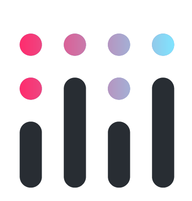
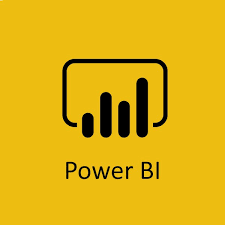

 

  
 
    
  

  

    
 
  

     
          
     

 
                                                                                                                                           

---
Hey there 👋

I’m **Alhassane**, a **Data Analyst** living in Paris.

I used to work as a sales representative in IT industry.

I'm a son, a brother, a best friend, the cool friend who likes to go out on weekends...

I'm also a passionate person & I 💖 Artificial Intelligence. That's why it was not difficult to put aside my dear weekends and invest my time and money to learn a new job…

Today, I work on awesome Machine Learning projects while having fun 😎...

---
                                                                                                                                           
**Favorite data processing tools**

 

 
 
 

**Favorite viz/dashboarding tools**

 

 
 
 

**Other tools**

 
